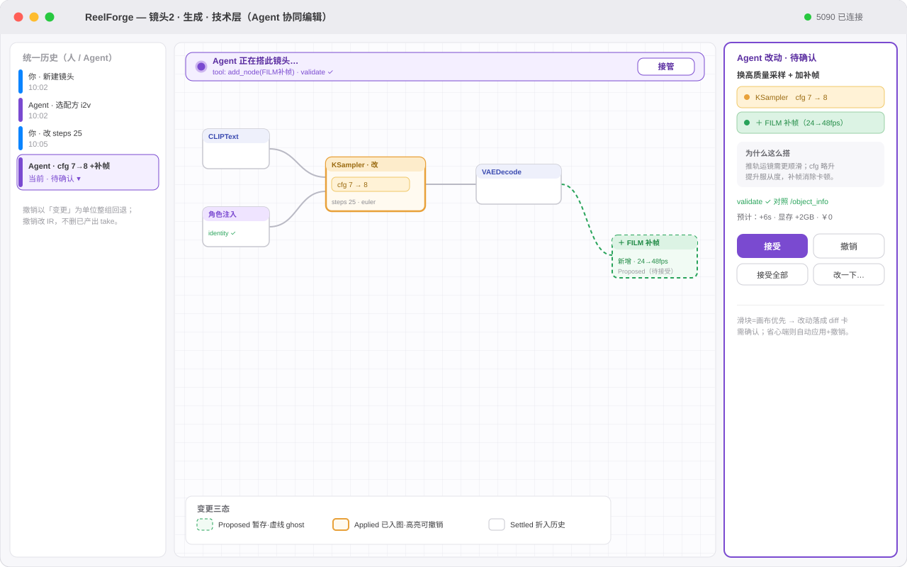
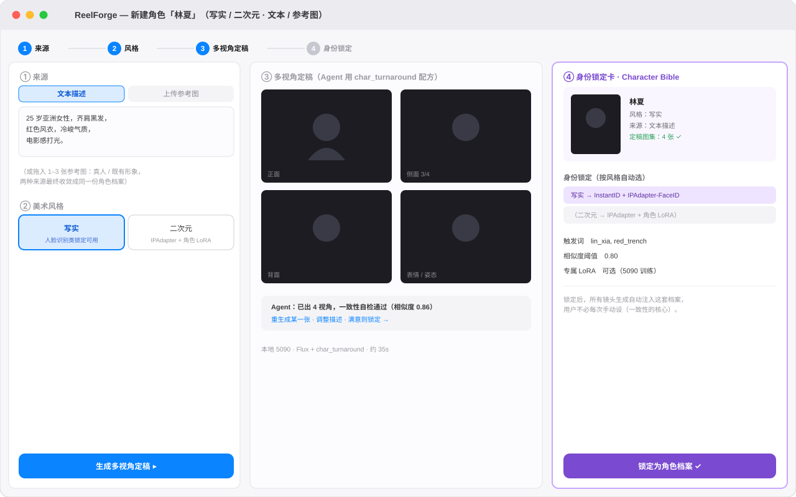
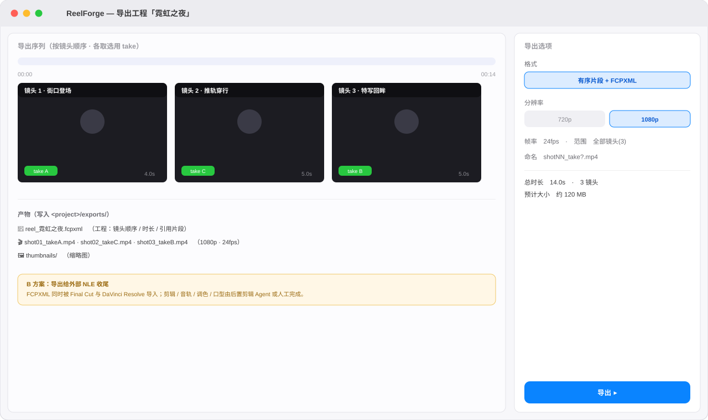

# 关键界面视觉稿（线框 / 视觉草图）

低保真线框稿，用于对齐界面结构与信息架构，不是最终视觉。GitHub 直接渲染下方 SVG。
对应的 UI 核心问题见 [native-ui.md](native-ui.md)，流程图见 [diagrams.md](diagrams.md)。

## 1. 对话优先布局（入门）

默认隐藏节点图：左侧对话 + Agent 反馈（含定稿缩略图、「为什么这么搭」、快速旋钮），右侧大预览 +
折叠的画布缩略，一键展开。

## 2. 画布优先 · 导演层（生产力）

以**分镜头为主轴**的制片管理面（非节点画布）：顶部资产 / Character Bible 区；每个镜头一行，显示任务进度
（分镜 · 生成 · 选片）、预览、引用的资产（依赖）。右侧检查器含依赖关系（被引用 / 引用）、本地/云后端与
费用预估；底部任务队列与累计花费。点某镜头的任务（如「生成」）→ 进技术层 flow（见 §3）。

## 3. 技术层（钻进某镜头/任务的 ComfyUI 图）

> 即「技术层」：从导演层点某镜头的某个任务（如「生成」）钻入其执行 flow。生成任务是节点图，未来剪辑任务是时间线。

双击镜头进入节点图：执行中节点高亮 + 进度条 + latent 中间预览；上游节点打勾；Agent 改参以可接受/撤销的
diff 卡片呈现；右侧节点检查器，所有取值对照 `/object_info` 校验。

## 4. 选片对比

一个镜头的多条 take 网格，带美学评分与一致性；Agent 自动初筛并推荐、剔除漂移项；支持两两对比、
选用、补帧超分、再生成。

## 5. 资产库 · Character Bible

角色多视角定稿 + 表情姿态 + **身份锁定卡**（InstantID/PuLID、IPAdapter 参考图、可选专属 LoRA、触发词、
相似度阈值）——一致性的核心载体；下方显示被哪些镜头引用，改动后可一键重生成受影响镜头。

---

## 6. 两层视图：导演层（制片管理）→ 技术层（任务执行 flow）

配合 [native-ui.md](native-ui.md) 第二层。两层不是「同一画布的远近缩放」，而是**两种工作 → 两种 UI**：

- **导演层**（普通 SwiftUI 管理面，**围绕分镜头**）：资产 / Character Bible 在上，镜头逐行展开——每镜头
  显示任务进度（分镜·生成·选片）、预览、引用的资产（依赖）；项目级动作有导出、(未来)剪辑。**不是节点画布。**
- **技术层**（全应用唯一的画布）：点某镜头的某个任务（如「生成」）→ 钻进它的执行 flow。生成任务是 ComfyUI
  节点图；未来剪辑任务是时间线 surface。节点数天然有界（一张图几十个节点），**无需远近 LOD**。

## 7. Agent 协同编辑（diff / 三态 / 接管）

技术层里 Agent 改图以**变更三态**呈现：Proposed（虚线 ghost）/ Applied（高亮可撤销）/ Settled。改动配 **diff 卡**
（改了啥 + 为什么这么搭 + `validate ✓` + 预估 + 接受/撤销/接受全部/改一下）；镜头处于「Agent 正在搭」时可一键**接管**；
左侧统一历史按人 / Agent 着色，可整组撤销。对应 [native-ui.md](native-ui.md) ①+④。

## 8. 角色创建（写实/二次元 · 文本/参考图）

来源（文本描述 / 上传参考图）+ 风格（写实 / 二次元）→ 多视角定稿 → 身份锁定卡。**身份锁定方法按风格自动选**
（写实 → InstantID/IPAdapter-FaceID；二次元 → IPAdapter + 角色 LoRA）；两种来源收敛成同一份角色档案。

## 9. 导出工程

按镜头顺序拼选用 take，导出 **1080p 片段 + FCPXML**（给 Final Cut / DaVinci 收尾，B 方案）；右侧导出选项。

---

> 端到端的「用户 ↔ 软件」交互用例（从空项目到导出）见 [walkthrough.md](walkthrough.md)。
