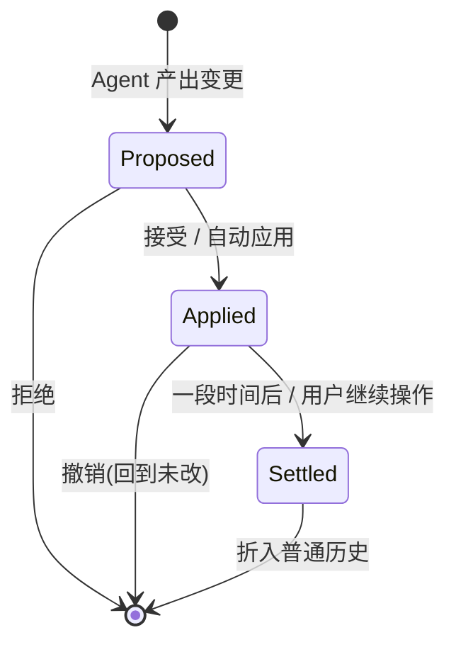
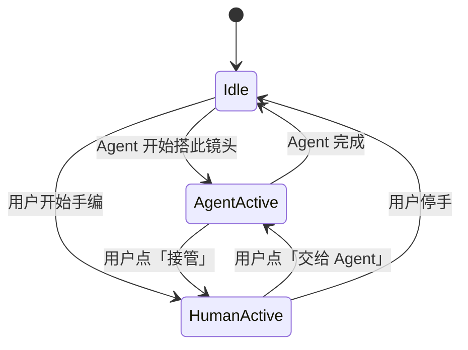

# macOS 原生 UI 设计

> 本文记录「macOS 原生 UI 设计要解决的核心问题」的讨论与结论。
> 界面视觉稿见 [mockups.md](mockups.md),流程图见 [diagrams.md](diagrams.md)。
>
> 进度:**①+④(Agent×画布协同)、②+③(双层视图与画布)已对齐 v0.1**;第三层(反馈 IA / 一致性)待讨论。

---

## 头号设计原则:单模型,多操作端,对称写入

> **模型(Project / Graph IR)是唯一的「名词」;chat-驱动的 Agent、画布直接操作、(将来的
> iPad / Web 客户端)都只是「动词的入口(操作端)」。任何入口能做的写操作,都通过同一套 op API,
> 落进同一份模型、同一条历史。**

Agent 不是特殊角色,而是「碰巧由 LLM 驱动的那个操作端」。由此:

- **不需要 Agent 也能搭整条 workflow**(全手动是一等路径,不是降级模式);也可以**全 Agent 完成**,
  或 **Agent 起手 + 后续手动微调**——三者还能在同一项目内按镜头**共存**。
- **op API 对称**:Agent 能做的人都能做,人能做的 Agent 原则上也能做。对称是「互相接管」的前提。
- **Agent 只是未来多客户端里的一员**:加新客户端 = 加新操作端,接同一套 op API,不碰模型与 Agent
  (呼应 [architecture.md](architecture.md) 的后端无状态化 + 服务器侧持久化)。

### 架构完整 vs UI 分阶段(对「MVP 只做轻编辑」的调和)

「手动必须完整」是**架构不变量**,不是 MVP 的 UI 承诺:

- **Day 1 必须完整且对称**:IR 数据模型 + op 词汇(动词全集)。这层是手/Agent 双向完备的超集,
  **绝不能后补**,否则将来解锁全手动要返工。
- **可分阶段铺**:画布 UI 暴露的动词**子集**。MVP 画布先给轻编辑(改 widget / 连断线 / 增删节点),
  够微调、也够看懂 Agent 干了啥;从零手搭复杂拓扑的体验后续加——因底层 op 已齐全,是**纯加 UI,
  不动地基**。

---

## 核心问题 ①+④:Agent 与画布的协同编辑(已对齐 v0.1)

原议题清单中的 #1(双外壳统一)与 #4(Agent 与画布协同)是同一问题的两面:**人 + Agent 协同编辑
单一事实来源**。

### 1. 统一编辑模型(无特权写路径)

人在画布上的手势,与 Agent 的工具调用,产出**同一种东西**——一段对 IR 的有序操作(ops),即
[api-contract.md](api-contract.md) 的 `graph_patch`。

- 项目层 op:`create_shot` / `assign_asset` / `set_meta` …
- 图层 op:`add_node` / `delete_node` / `connect` / `set_param` / `set_pos` …

一个「变更(change)」= 一串 ops + 元数据:`author`(`human` | `agent`)、时间戳、(Agent 的)
`rationale`(「为什么这么搭」)、来源 `tool_call`。因为人和 Agent 产出**同构**的变更,undo、diff、
接管才能用一套机制解决,而非两个系统对账。「人接管」本质就是「人也开始发 ops」。

### 2. 变更的三态生命周期(挂到「省心↔掌控」滑块上)

- **Proposed**:暂存,不进 live IR,画布上以 ghost / diff 叠层呈现。
- **Applied**:已进 live IR,但仍「新鲜」——高亮 + 一键撤销。
- **Settled**:折入普通历史,不再高亮。

**「双外壳」不是开关而是连续滑块**,同一滑块控制布局 + 改图审核门槛:

| 滑块位置 | Agent 改图行为 |
|---|---|
| 对话优先(省心) | **自动应用**(跳过 Proposed)+ 醒目撤销;用户看着它发生、可回退 |
| 中间 | 改参自动应用;**拓扑改动**(增删节点 / 换子图)停在 Proposed 等确认 |
| 画布优先(掌控) | 一律落成 **Proposed diff 卡**,接受后才碰你的图(支持「接受全部」) |

### 3. diff 视觉语言(两层共用)

- **新增**节点 / 连线:绿框 + `+`,Proposed 时半透明
- **改参**节点:琥珀框 + 节点上 diff chip(`steps 20→28`),点开看完整前后对比
- **删除**:红色虚线 ghost,保留到 settled

每个变更带一张 **diff 卡**(锚在改动区域 / 侧栏堆叠):一句话改了啥 + 「为什么这么搭」+
`validate ✓(对照 /object_info)`+ 估算(耗时 / 费用变化)+ 按钮 `接受 / 撤销 / 接受全部 / 改一下`。

### 4. 并发与接管:以「镜头」为锁粒度

工作流层是「钻进单个镜头的聚焦子画布」,故锁 / 回合粒度 = **镜头**:

- **AgentActive**:角标「Agent 正在搭…」+ 实时 tool-call 跑马灯;用户可「观看 / 接管」。
- **接管**:在下一个 op 边界(不打断半个 op)暂停 Agent,把笔交给人;Agent 剩余计划降级为
  Proposed,可续跑或弃掉。
- **不做真并发合并(CRDT)**:单镜头任意时刻只有一个 actor 持笔(细粒度回合制)——对「单人 +
  其 Agent」是正确的复杂度。**跨镜头自由并行**(Agent 渲染镜头 3 时人改镜头 5);导演 Agent 跨镜头
  计划时按触及顺序逐镜头持笔,项目层显示哪些镜头被本次 run 排队 / 占用。

### 5. 统一历史 / 撤销(兼任可解释日志)

每个变更带 author,串成**一条线性历史**,按作者着色(「你: 移动节点」「Agent: 换用 i2v_cloud
配方(+3 节点)」)。Agent 的多 op 变更作为**一组**撤销,可展开。这条历史同时是「为什么这么搭」的
审计日志,也是产物时间线的锚。

要点:**撤销改的是 IR 状态,不删已产出的 take**——take 是钉在镜头上的不可变产物(尤其云上已计费的)。

「为什么这么搭」一份文案,三处复用:diff 卡(就地)、chat 流(叙事)、历史(可审计)。

### 6. 战术默认(初步,可改)

1. **省心端默认自动应用 + 醒目撤销**;另给谨慎用户全局开关「改图前总是先问我」。
2. **重大改动阈值**:拓扑改动(增删节点 / 换子图)= 重大需确认;纯改参 = 自动应用。
3. **撤销**:MVP 用全局线性;按镜头分支历史留作后续。

---

## 核心问题 ②+③:两层视图与画布(已对齐 v0.1)

关键判断:两层不是「同一画布的远近缩放」,而是**两种工作 → 两种 UI**(示意图见 [mockups.md](mockups.md) §6)。

### 1. 导演层(制片管理面,围绕分镜头)

负责资产、分镜任务的进度 / 预览 / 依赖关系管理,未来含剪辑。**不是节点画布**,是普通 SwiftUI 管理面:

- **以分镜头为主轴**:每个镜头一行,显示其任务进度(分镜 · 生成 · 选片)、预览缩略、引用的资产(依赖)。
- 顶部资产 / Character Bible 区(共享,角色档案是一致性锚点);项目级动作:导出、(未来)剪辑。
- 依赖关系用**结构化呈现**(检查器 / 关系面板:「此镜头用了 林夏·夜市装·雨夜街」「林夏 被镜头 1/2/5 引用」),
  不做自由节点海。

### 2. 技术层(任务执行 flow,全应用唯一的画布)

从导演层**点某镜头的某个任务**(如「生成」)钻入它的执行 flow,面包屑返回:

- **按任务类型而异**:生成任务 → ComfyUI 节点图;**未来剪辑任务 → 时间线 / NLE surface**。导演层统一管
  「任务 + 进度 + 依赖」,技术层因任务而变——剪辑后置因此顺理成章。
- **节点数天然有界**(一张图几十个节点),所以**不需要远近 LOD / 视口剔除 / 毛球治理**那一套。
- **渲染**:MVP 用「全 SwiftUI 节点 + 一层连线(SwiftUI Canvas 或薄 Metal)」即足;混合 / 全 Metal 仅作为
  「将来单图特别大时的逃生口」,非 MVP 必选。

### 3. 与第一层自洽

导演视图与技术视图是**同一份 IR 的两个视图**——正如人 / Agent 是同一模型的两个操作端(见头号原则)。
[mockups.md](mockups.md) §1–5 的视觉稿仍适用(对话/选片/Character Bible),其「画布优先 · 项目层」一图按本节
重新理解为「导演层 = 制片管理面」而非节点画布。

---

## 其余待讨论的核心问题

**第三层(差异化)**
- **多反馈信息架构**:进度 / 中间预览 / 产物时间线 / 选片对比 / 费用——哪些贴节点、哪些进检查器、
  哪些进全局活动栏,不淹没用户。
- **一致性资产呈现**:Character Bible 在 UI 的位置 + 「自动注入一致性」的透明化与可控(徽标 / 可展开
  看注入了什么 / 可覆盖)。

**横切关注点(融进上面各层去解,不单独立项)**
- 入门引导 vs 专家效率(渐进披露 / 模板入口 / 快捷键)。
- 远程感知(连接状态 / 传输进度 / 服务器忙闲 / 断线恢复)。

---

## 设计原则(累积)

- 单模型,多操作端,对称写入(见头号原则)。
- 画布是「事实来源」的可视层,不是另一份状态。
- 反馈优先:用户任何时候都能看到「在干什么、到哪了、长出了什么」。
- Agent 可解释、可撤销;人随时能接管。
