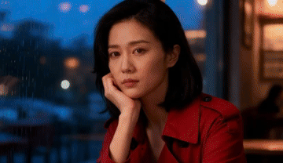
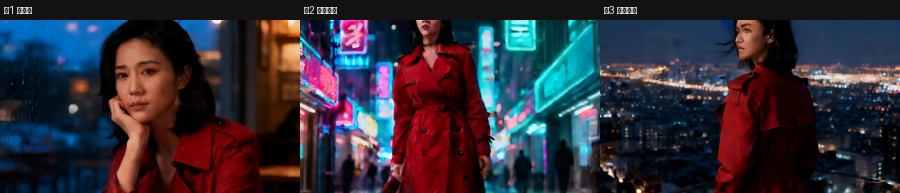
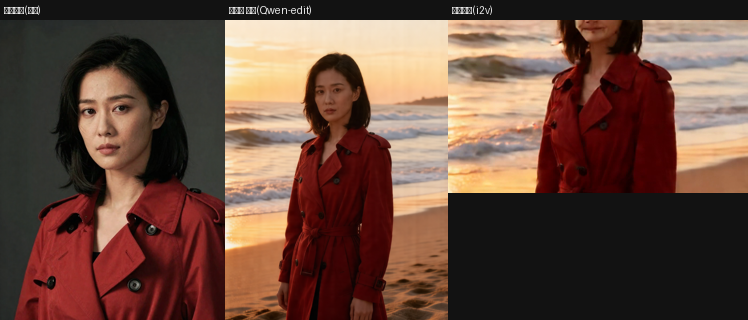
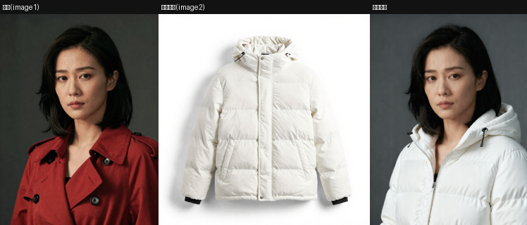
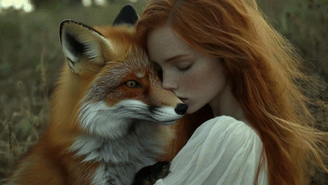

# Spike / Build 成果画廊

> GitHub 网页会内联渲染下面的 GIF/图片(GIF 会自动播放),mp4 点开 blob 也能播。

## 阶段3 成片:一段剧本 → 多镜头一致成片

一段中文情境 → glm-5.2 导演拆 3 镜头 → 每镜头 Qwen-edit 关键帧 + WAN i2v → 拼成片。同一角色跨咖啡馆/街道/天台一致。

三镜头取帧:

成片 mp4:[stage3-film.mp4](stage3-film.mp4) · [e2e 3 镜头小样](e2e-minishot.mp4)

## 阶段1 单镜头管线:角色定稿 → 关键帧 → 视频

## M2 一致性

跨镜头关键帧(Qwen-edit,强一致):

i2v 视频(身份全程保持):[5B](m2-i2v-char.mp4) · [14B+lightx2v](m2-i2v14b.mp4)

Qwen-edit 把定稿编进场景(对比 anchor):

角色 LoRA vs 基线(人脸):

## M1 Agent 搭图样图

## 阶段3.5 多资产组合:角色 + 服装资产 → 组合关键帧
角色(image1,红风衣)+ 服装资产(image2,白羽绒服)→ 同一张脸换上新服装(Qwen-edit 多图参考)。

## 阶段3+ 导演自动编排资产
导演读剧本+资产库,**自动把"白羽绒服"资产分配给镜头2**并组合出片(雪天换装,同一张脸):

## 阶段6 云端 reference-to-video(火山 Agent Plan · 豆包 Seedance)
经火山方舟 Agent Plan(`/api/plan/v3`,doubao-seedance-1.5-pro)图生视频,端到端跑通(create→poll→download):

