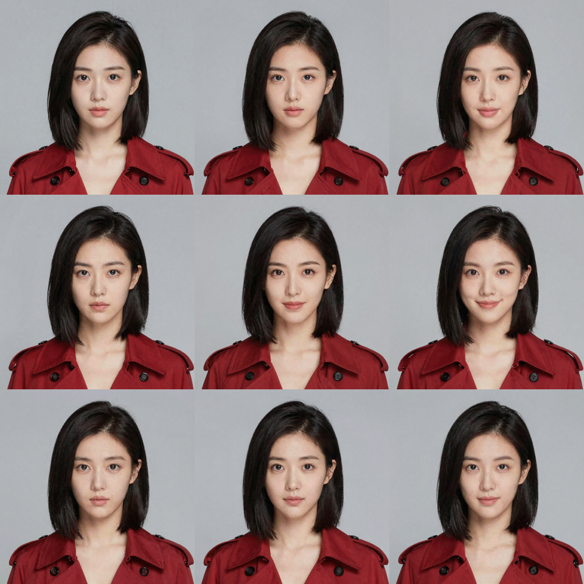
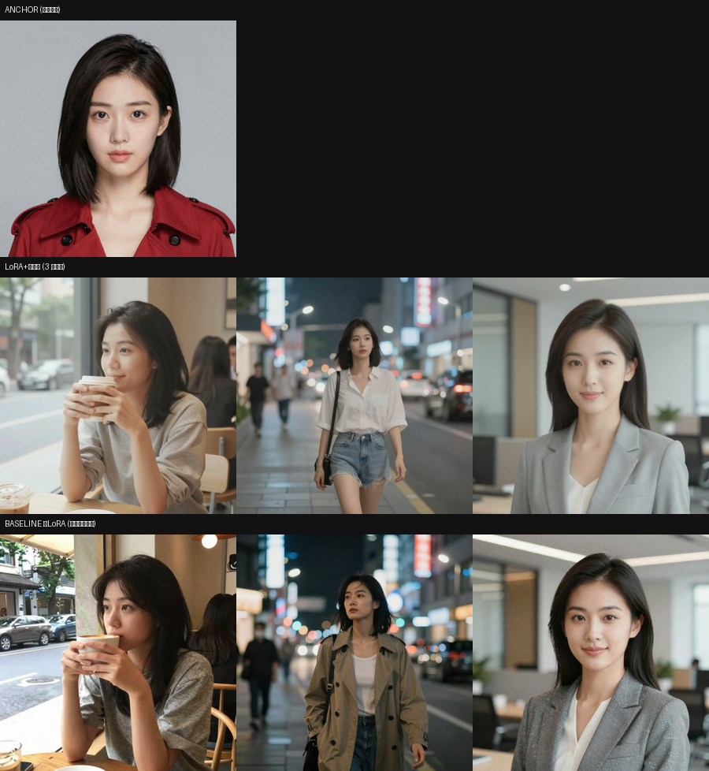
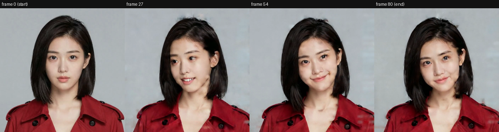

# ReelForge Spike 结论总结（M1 + M2）

> 时间：2026-06 · 环境：RTX 5090 32G @ `10.10.10.2`（ComfyUI 0.24）+ DGX 120G @ `10.10.10.5`（LiteLLM 网关）。
> 详见 [dev-kickoff.md](dev-kickoff.md) / [spike-plan.md](spike-plan.md) / [env-survey.md](env-survey.md) / [spike-m2-results.md](spike-m2-results.md) / [missing-models.md](missing-models.md)。

---

## TL;DR

- **M1（Agent 搭图 PoC）✅ 跑通**：自然语言 → Agent 选配方 → `validate`(对照 ComfyUI `/object_info`) → 出图。三项验收全过。
- **M2（一致性 spike，写实线）✅ 有结论**：
  - **角色 LoRA**（图像）：跑通，但被 5090 的 32G 显存卡在 256² 训练 → 身份一致性**中等**。
  - **参考条件 → 视频**（免训练）：WAN 2.2 i2v 角色关键帧→视频，**身份全程保持，32s 出片** → 强、快、零训练。
- **结论**：**MVP 默认一致性走"参考条件"路线（5090 原生、快、proven）；角色 LoRA 作为主角高保真的可选增强**。两条路并存，对应 Character Bible。

---

## M1：Agent 搭图（已交付，commit `6cf40c4`）

自然语言意图 → `search_recipes` → `instantiate_recipe`(Graph IR=prompt+pos) → `validate`(对照真实 `/object_info`) → `run`(POST /prompt→轮询→取产物)。Agent 经 **LiteLLM 网关**调用（glm-5.2 / qwen3-coder-plus 等，tool-use 稳）。`run` 设 validate 前置门槛，流程不依赖模型合规。

**配方 `char_concept`** = 5090 实装 **Z-Image Turbo**（已手搭验证可出图）：`UNETLoader→ModelSamplingAuraFlow(shift=3)→KSampler(res_multistep/simple,8步,cfg=1)`；`CLIPLoader(qwen_3_4b,type=lumina2)`；`EmptySD3LatentImage`(16ch)+`ae.safetensors`（**避开 WAN VAE 48ch 通道不匹配的坑**）。

验收：① 端到端出定稿图 ✅　② `validate` 拦非法 sampler 枚举 ✅　③ IR `prompt+pos` 往返无损 ✅

Agent 自主出图样例（左：glm-5.2 男性办公肖像；右：qwen 女性红风衣）：

| M1 sample (man, glm-5.2) | M1 sample (woman) |
|---|---|
|  |  |

---

## M2：一致性 spike（写实线，commit `e11da29`）

### 装机现实（影响方法选型）
- **只有 Z-Image Turbo 完整可训**；Flux-2 Klein 缺 `qwen_3_8b`+`flux2-vae`(~10GB)；Qwen-Image-Edit 缺 edit 基模(~20GB)。
- **32G 显存只够 256² LoRA 训练**（512² OOM）。

### Track A · 角色 LoRA（图像身份）
1. **训练集 bootstrap**（无 IPAdapter）：Z-Image **img2img 共享潜变量** 从 1 张定稿派生 9 张身份一致图。
   
2. **训练**：`MakeTrainingDataset→TrainLoraNode(256²,rank8,lr2e-4,500步)→SaveLoRA`，445s。
3. **评测**：LoRA+触发词在 3 个新场景出图 vs 同提示同种子的无 LoRA 基线。

   整图对比（上=LoRA 三场景，下=基线无 LoRA）：
   

   人脸对比（上排 anchor+LoRA，下排基线）——**LoRA 行明显更像 anchor、彼此更一致**：
   

   **结论**：即便 256² 约束下也有**可见的中等身份迁移**；非硬锁定，要更强需更高训练分辨率 + 非 distilled 基模。

### 参考条件 → 视频（免训练，**推荐 MVP 路线**）
公网即梦/通义/可灵/Vidu 的"几张定妆照→强一致视频"原理 = **参考图当条件**（IP-Adapter / ReferenceNet / DiT in-context KV 注入 + 人脸 embedding），把"保身份"内化进基模、推理零训练。

本机等价已验证：**WAN 2.2 5B i2v**，角色关键帧 → 3.4s 视频，身份在 frame 0/27/54/80 **全程保持**，**32s 出片，零训练**。

成片：[spike-assets/m2-i2v-char.mp4](spike-assets/m2-i2v-char.mp4)

---

## 角色 LoRA vs 参考条件：定位与并存

| | 角色 LoRA | 参考条件 |
|---|---|---|
| 产物 | 一致**图片/关键帧**（不直接出视频） | 直接 keyframe→视频 / 主体参考→视频 |
| 何时学身份 | 推理前训练（需一致训练集） | 厂商预训练，推理零训练 |
| 5090 上 | 受 256² 限，中等一致 | 快（32s/3.4s），强一致，proven |
| 定位 | **主角高保真**（值得训） | **MVP 默认 + 配角/赶时间** |

**并存方式**（映射 Character Bible：定稿图集 + identity锁定 + 触发词 + 可选 LoRA）：图像阶段用 LoRA 或参考锁身份出关键帧 → 视频阶段用 i2v 动起来；或直接主体参考→视频。Agent 按镜头挑路。

---

## 算力方案（已据"DGX 带宽受限、生成慢"修正）

两层本地算力，按"延迟敏感 vs 显存/吞吐"分工：

- **5090 32G = 快速交互层**（compute 快、模型已装、可直接下模型）：承载 MVP 的图像 + i2v 视频、所有需要快反馈的迭代/选片。
- **DGX 120G = 大显存·延迟容忍层**（内部带宽受限、**生成慢**，但显存大）：**不作交互/实时生成**，但有明确用武之地——
  ① 现役 **LLM 网关(LiteLLM)**；② **跑放不进 5090 32G 的大模型**（如 Wan-Animate 14B bf16 34G、Flux-2、大视频模型）；
  ③ **无人值守的批处理**（如过夜高分辨率 LoRA 训练——训练吃吞吐不吃延迟，慢点无妨）；④ 给 5090 分流后台任务。
- **MVP 一致性主路径 = 5090 上的参考条件（i2v / reference-to-video）**，绕开训练瓶颈、走快速层。
- 增强项按需下到 5090：lightx2v 4 步加速、Wan-Animate（角色动作）；见 [missing-models.md](missing-models.md)。
  （Orchestrator 可据"延迟敏感度 + 显存需求"在 5090/DGX 间路由，与设计的本地/云路由同构。）

> 模型下载：**可由本会话直接 `wget` 到 5090 的 ComfyUI models 目录**（容器以 zhangnan 运行、overlay 可写、host 通 HF、675G 余量）。之前"无法下载"的说法有误，已更正（见 missing-models.md）。

---

## 下一步候选
1. 下 **lightx2v 4 步 LoRA**（~1.2GB）→ 提速 14B i2v 定稿视频。
2. 下 **Wan-Animate** → 验证"让角色做指定动作"的强一致视频（最接近云服务）。
3. 接通**云 reference-to-video**（即梦/Vidu partner 节点，配 key）作对照/兜底。
4. 把"参考条件"沉淀为 Orchestrator 的一致性配方（i2v_local / ref2video），纳入 M2→M3 管线。
