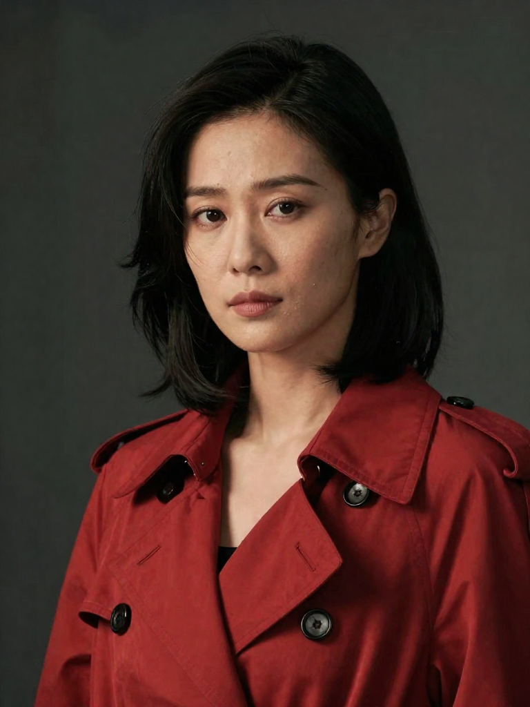
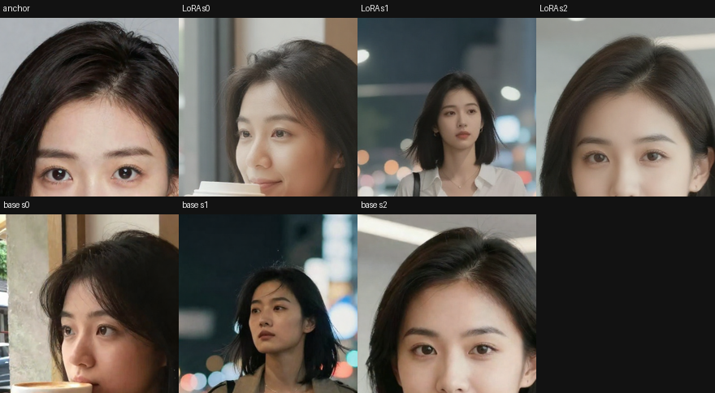
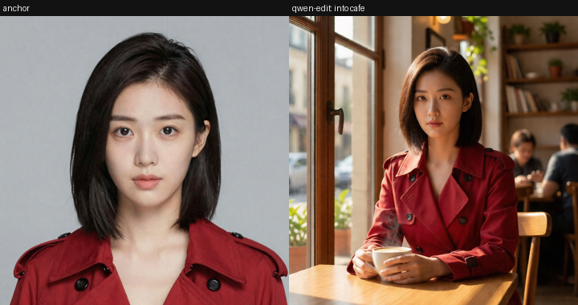
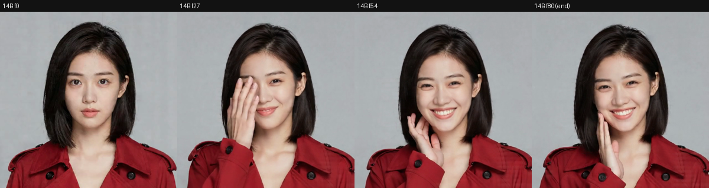
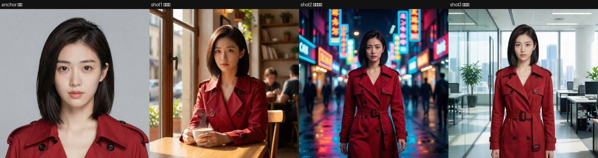

# ReelForge Spike 结论总结（M1 + M2，含 e2e）

> 时间：2026-06 · 环境：RTX 5090 32G @ `10.10.10.2` + DGX Spark GB10 128G @ `10.10.10.5`（详见 [env-survey.md](env-survey.md)）。
> 配套：[spike-m2-results.md](spike-m2-results.md)（M2 细节）· [missing-models.md](missing-models.md)（模型清单）· [open-questions.md](open-questions.md)（决策）。

---

## TL;DR

- **M1（Agent 搭图）✅** 自然语言 → 选配方 → `validate`(对照 `/object_info`) → 出图,经 LiteLLM 调模型(glm-5.2 稳)。
- **M2（一致性）✅ 已出决策**:
  - **图像身份(关键帧)**:**Qwen-Image-Edit** 把定稿角色编进任意场景 → **强一致、15s、零训练**(胜出);角色 LoRA 中等(256² 受限)、作备选。
  - **视频生成**:**WAN i2v** 关键帧→视频,身份全程保持(5B 草稿 32s / 14B+lightx2v 定稿 28s)。
  - **e2e 跨镜头**:一张定稿 → Qwen-edit 编进 3 场景 → 各自 i2v → 3 镜头小样,**同一角色跨镜头成立**。
- **结论**:**项目最大风险(跨镜头一致性)已retire**。可行性 ~完成,**可进入产品技术方案设计 + 编码**。

---

## M1：Agent 搭图（commit `6cf40c4`）

意图 → `search_recipes` → `instantiate_recipe`(Graph IR=prompt+pos) → `validate`(真实 `/object_info`) → `run`。Agent 经 **LiteLLM 网关**(OpenAI 兼容)调模型;`run` 设 validate 前置门槛。配方 `char_concept`=Z-Image Turbo(已验证可出图)。验收:出图 ✅ / validate 拦非法枚举 ✅ / IR 往返无损 ✅。

| M1 sample (man, glm-5.2) | M1 sample (woman) |
|---|---|
|  |  |

---

## M2：一致性 spike（写实线，commit `e11da29` + 本轮）

### 装机现实
- 图像基模:**Z-Image Turbo**(完整可用,distilled turbo);**Flux-2 Klein 9B**(已补 `qwen_3_8b`+`flux2-vae`,可用);**Qwen-Image-Edit 2511**(已下 fp8mixed 20.5G)。
- 视频:**WAN 2.2** i2v/t2v 14B + ti2v 5B(全装) + **lightx2v 4 步加速 LoRA**(已下)。
- 训练:`TrainLoraNode` 全套;**5090 32G 仅够 256² 训练**(512² OOM)。

### Track A · 角色 LoRA（图像身份，备选）
Z-Image img2img 共享潜变量从 1 张定稿派生 9 张一致训练集 → `TrainLoraNode(256²,rank8,500步,7.4min)` → LoRA+触发词在 3 新场景出图。**结果:中等身份迁移**(明显比基线像 anchor,非硬锁定;受 256² 限)。

### Track B · Qwen-Image-Edit（图像身份，**默认**）★
定稿角色 → 编辑指令"把这个人放进 X 场景,保持面部/发型/服装不变" → **强身份保持**,15s,零训练。

### 视频链路 · WAN i2v
- **5B i2v**:关键帧→3.4s,身份全程,32s 出片。
- **14B + lightx2v 4 步**:质量更高、动作更丰富,**28s**。

成片:[5B](spike-assets/m2-i2v-char.mp4) · [14B](spike-assets/m2-i2v14b.mp4)

### E2E 微样片（整链跨镜头）★
一张定稿 → Qwen-edit 编进 **咖啡馆 / 霓虹街道 / 办公室** 3 个关键帧(**跨镜头身份强一致**)→ 各自 i2v → 拼 3 镜头小样。

视频中帧(动起来后仍是同一角色):

成片:[3 镜头小样](spike-assets/e2e-minishot.mp4)

---

## 一致性方法决策表（MVP 默认）

| 环节 | **默认方法** | 备选 | 依据 |
|---|---|---|---|
| **角色来源 → 角色档案** | 文生图定稿(Z-Image/Flux-2)→ 作参考；或用户上传参考图 | — | data-model D2 |
| **图像身份锁(出关键帧)** | **Qwen-Image-Edit**(定稿编进场景,强一致,15s,零训练) | 角色 LoRA(中等,需训练,DGX 高分可提升)；Flux-2 原生参考(待验) | Track B + e2e |
| **视频生成** | **WAN i2v**(关键帧→视频;5B 草稿 / 14B+lightx2v 定稿) | 云 reference-to-video(即梦/Vidu,配 key) | M2 链路 + e2e |
| **超分/补帧(后置)** | 4x-UltraSharp(超分✓) | RIFE/FILM(补帧,待下) | env-survey |

> **一句话**:**Qwen-edit 关键帧 + WAN i2v** 是 MVP 一致性主路径,零训练、跨镜头成立;角色 LoRA 留给主角高保真(在 DGX 高分训练)。

---

## 算力方案（两层本地 + 多后端路由，决策 [open-questions A6](open-questions.md)）

- **5090 32G = 快速交互层**:交互式图像、Qwen-edit、i2v 视频、快迭代/选片。
- **DGX Spark GB10 128G = 大显存·延迟容忍层**(统一内存、带宽低·生成慢):**角色 LoRA 高分辨率训练**(破 256²)、放不进 32G 的大模型、过夜批处理;现役 LLM 网关。
- **云层**:reference-to-video / 突发 / 不自托管的模型。
- Orchestrator 维护后端注册表,按「延迟敏感度 + 显存 + 能力 + 成本」路由(见 [architecture.md](architecture.md) §3)。
- **模型下载**:本会话经 SSH `wget` 直接下到 5090 `basedir/models`(host 通 HF,余 675G);DGX 外网走 WiFi 较慢,大模型可"5090 下→千兆 LAN 传 DGX"。

---

## 已下载 / 跳过的模型（本轮）

**已下到 5090**:Qwen-Image-Edit 2511 fp8mixed(20.5G)+ qwen_image_vae + qwen_3_8b(8.7G)+ flux2-vae + **lightx2v i2v 4 步 LoRA**(high/low)。
**跳过/取消**:Wan-Animate(34G,**无驱动视频条件,取消**);Phantom(仅社区 GGUF,推迟);IPAdapter/InstantID/PuLID(对 2026 基模不适配)。详见 [missing-models.md](missing-models.md)。

---

## 可行性结论 & 进入设计/编码

- **核心技术风险已retire**:跨镜头一致性 = Qwen-edit 关键帧 + WAN i2v,零训练、e2e 验证成立。
- **剩余收尾(非阻塞)**:定量身份距离(insightface)、Flux-2 作更优 LoRA 基模实测、云 reference-to-video 对照。
- **可进入产品技术方案设计 + 编码**。见 [mvp-tech-plan.md](mvp-tech-plan.md)(MVP 技术方案)与 [dev-plan.md](dev-plan.md)(开发计划)。
