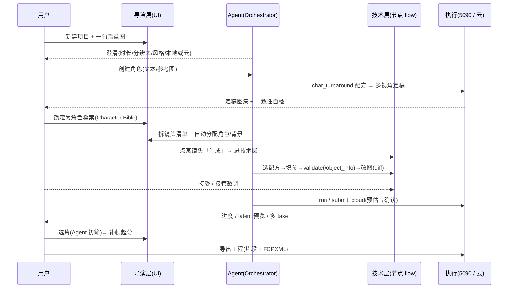

# 从 0 到 1：一支短片的完整交互用例

用一个具体场景，把「用户做什么 ↔ 软件 / Agent 做什么」从**空项目**走到**导出工程**串成一条线，
并标注每步对应的界面（[mockups.md](mockups.md)）与机制（[native-ui.md](native-ui.md) / [pipeline.md](pipeline.md)）。

> 场景：用户想做一支 3 镜头的角色短片**「霓虹之夜」**——写实风格，主角林夏在雨夜街头登场、穿行、回眸。
> MVP 范围：资产 → 分镜 → 生成 → 选片 → 导出（无音频，剪辑后置）。

---

## 总览时序

---

## 分步交互

### 步骤 0 · 起步：意图 → 澄清
- **用户**：新建项目「霓虹之夜」，在对话里说「做个雨夜街头、女主登场穿行回眸的写实短片，三个镜头」。
- **软件**：Agent 不够信息就**澄清式提问**——时长 / 分辨率 / 帧率、写实还是二次元、本地还是云。
  用户确认：写实、1080p、24fps、单镜头 3–5s、优先本地。
- **界面**：对话优先布局（[mockups §1](mockups.md)）。滑块此刻偏「省心端」。

### 步骤 1 · 角色定稿（一致性的根）
- **用户**：新建角色「林夏」，选**来源**＝文本描述（或拖入参考图），**风格**＝写实，填外观描述，点「生成多视角定稿」。
- **软件**：Agent 用 `char_turnaround` 配方在**本地 5090** 出正/侧/背/表情 4 视角，做一致性自检（相似度）。
- **用户**：满意 → **锁定为角色档案**。
- **软件**：把「定稿图集 + 身份锁定（写实→InstantID/IPAdapter-FaceID）+ 触发词」存进 **Character Bible**。
- **界面**：角色创建（[mockups §8](mockups.md)）、Character Bible（[mockups §5](mockups.md)）。
- **机制**：来源不论文本 / 参考图都**收敛成同一份档案**；风格决定锁定方法（[agent-system §5](agent-system.md)）。

### 步骤 2 · 其余资产
- **用户**：同法建「服装·夜市」「背景·雨夜街」（或让 Agent 按剧本一次性铺）。
- **软件**：资产入库，成为可复用、可锁定的一等公民。

### 步骤 3 · 导演层总览 + 拆镜头
- **软件**：Agent 把意图拆成**镜头清单**（镜头1 登场 / 镜头2 穿行 / 镜头3 回眸），自动给每镜头分配角色与背景（依赖）。
- **用户**：在导演层看到以**分镜头为主轴**的制片面：每镜头的进度（分镜·生成·选片）、预览、引用的资产。
- **界面**：导演层制片管理面（[mockups §2](mockups.md)）。

### 步骤 4 · 分镜关键帧
- **用户**：点镜头2 的「分镜」任务。
- **软件**：Agent 用 inpaint / ControlNet 把**林夏（注入档案）+ 夜市装**摆进雨夜街，出起始帧（必要时尾帧）。
- **界面**：钻入技术层（[mockups §3](mockups.md)、[导航 §6](mockups.md)）。

### 步骤 5 · 生成（核心：Agent×人协同 + 多反馈）
- **用户**：点镜头2 的「生成」任务 → zoom 进**技术层 flow**。
- **软件**：Agent 选 `i2v` 配方 → 填参 → `validate` 对照 `/object_info` → 局部改图；改动以 **diff 卡 + 三态**呈现
  （写实推轨建议 cfg 7→8、加 FILM 补帧），附「为什么这么搭」+ 预估耗时/费用。
- **用户**：**接受**改动；或点**接管**自己微调某个 widget（人 / Agent 在镜头粒度交替持笔）。
- **软件**：`estimate` 后执行——本地 Wan 出草稿、或云（即梦）出定稿（**先预估→确认→计费**）；实时回推
  节点高亮 + 进度 + latent 预览，产出**多条 take**。
- **界面**：Agent 协同编辑（[mockups §7](mockups.md)）。
- **机制**：单模型多操作端、变更三态、统一历史可撤销（[native-ui.md](native-ui.md)）；本地/云路由（[pipeline §2](pipeline.md)）。

### 步骤 6 · 选片
- **用户**：进选片视图看镜头2 的多 take。
- **软件**：Agent **自动初筛**（美学评分 + 一致性），推荐、剔除漂移项；用户两两对比、**选用**，可补帧/超分或再生成。
- **界面**：选片对比（[mockups §4](mockups.md)）。

### 步骤 7 · 三镜头跑通 → 导出
- **用户**：镜头1/3 重复步骤 4–6；三镜头都选好 take 后，点「导出工程」。
- **软件**：按镜头顺序拼选用 take，写入 `<project>/exports/`：**1080p 片段 + FCPXML**（给 Final Cut / DaVinci 收尾）。
- **界面**：导出工程（[mockups §9](mockups.md)）。

---

## 贯穿全程的暗线
- **一致性**：角色档案在每次生成时**自动注入**，用户不必反复设参（核心竞争力）。
- **多反馈**：进度 / 中间预览 / 产物时间线 / 选片对比 / 费用，导演层与技术层各司其职。
- **可解释 + 可撤销**：每个 Agent 改动都带理由、可接受/撤销，落进统一历史。
- **后置**：剪辑 / 音轨 / 口型 / 调色由后续独立「剪辑 Agent」做，本用例到「导出工程」为止。
